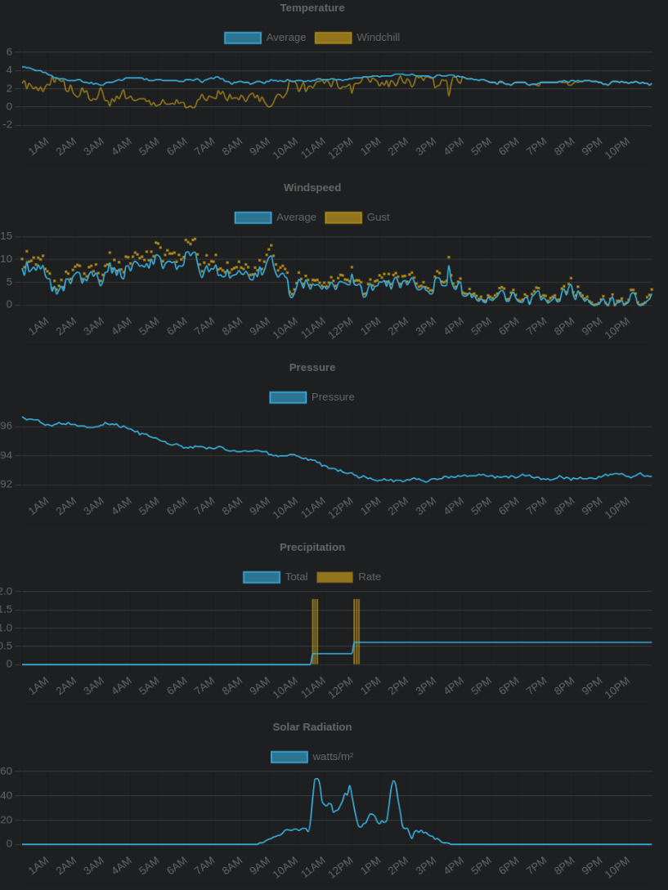

# Weather Dashboard

A simple weather dashboard for weatherunderground/api.weather.com for PWS.

Start with 

    npm install
    npm run start

Browse to:

    http://localhost:7775/?apiKey=<your-api-key>&stationId=<your-station-id>&numericPrecision=decimal&format=json&units=m

Screenshot:

